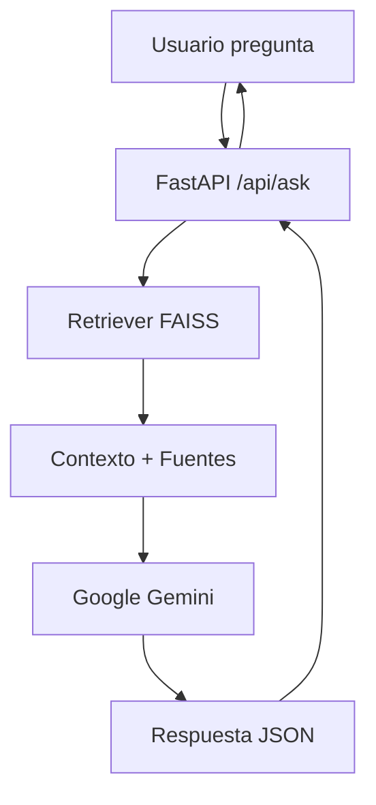

# 🏗️ Arquitectura – Punta Blanca RAG Agent

---

## 🔹 Flujo General (RAG)

1. **Usuario** envía una pregunta vía `/api/ask`.
2. **Retriever** busca chunks relevantes en el índice **FAISS**.
3. Se construye un **contexto** con fragmentos de texto.
4. Se pasa la pregunta + contexto al modelo **Google Gemini**.
5. Gemini devuelve un JSON con:
   - `answer`
   - `sources`
   - `confidence`
6. La API responde en formato estructurado.

---

## 🔹 Componentes

- **FastAPI**  
  - Define endpoints (`/api/ask`, `/healthz`).  
  - Usa **Pydantic** (`AskRequest`, `AskResponse`) para validación.

- **Retriever (retrieval.py)**  
  - Carga embeddings multilingües:  
    `sentence-transformers/paraphrase-multilingual-MiniLM-L12-v2`  
  - Indexa y consulta con **FAISS** (similarity/MMR).

- **Ingest (build_vectorstore.py)**  
  - Descarga contenido desde:
    - `puntablanca.ai`
    - Archivos locales (`linkedin.md`, opcional `facts.md`)
  - Limpia texto (Trafilatura).
  - Divide en **chunks** (~800 caracteres, overlap ~120).
  - Construye índice FAISS persistente.

- **Generator (generation.py)**  
  - Inicializa modelo **Gemini** (p. ej., `gemini-2.0-flash`).
  - Usa `system_instruction` para forzar salida **JSON**.  
  - Normaliza/asegura formato ante respuestas no válidas.

- **LangGraph (graph.py)**  
  - Define flujo tipo grafo: **input → retrieval → generation → output**.

---

## 🔹 Diagrama Simplificado

---

## 🔹 Despliegue

- **Local** con Uvicorn.  
- **Docker** → Imagen reproducible.  
- **Google Cloud Run** → Despliegue sin servidor.